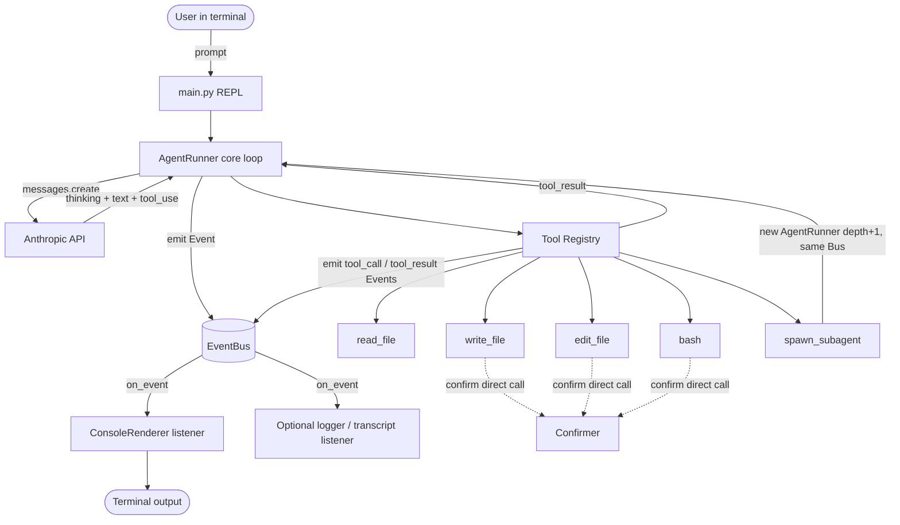
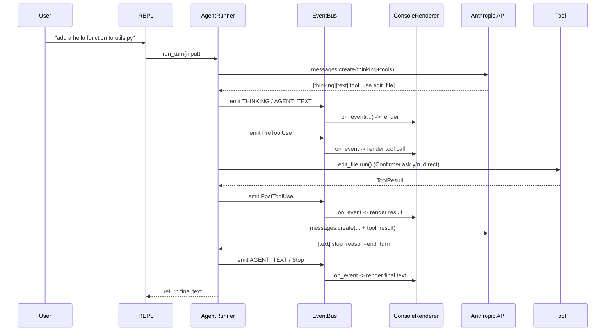

# Technical Architecture: Minimal Terminal Coding Agent

**Status:** Authoritative build spec. Derived from `requirements.md`.
**Audience:** Any engineer or AI agent implementing the system. This document is intended to be complete enough to build from without further clarification. Where the requirements left a detail open, this document makes an explicit, justified decision (look for **DECISION** callouts).

---

## 1. Purpose & Scope

Build a single-user, terminal-based coding agent in Python that uses the Anthropic Messages API to reason and call tools. It can read/write/edit files, run bash commands, and spawn sub-agents. Its reasoning (extended thinking) and tool activity are rendered in a polished terminal UI. The codebase is optimized for **readability as a teaching reference**, not production hardening.

In scope: interactive REPL loop, 5 tools, extended-thinking display, confirmation prompts, sub-agents, rich UI.
Out of scope (v1): streaming, persistence across sessions, multi-user, networked deployment, retrieval/embeddings, automated context compaction.

**Architecture style:** the system is **event-driven for observability**. The agent core does not know about `rich` or the terminal; instead it **emits events** (`thinking`, `agent_text`, `tool_call`, `tool_result`, `subagent_start`, `subagent_result`, `error`, …) onto an in-process `**EventBus`**. Output concerns (the terminal renderer, and optionally a logger or transcript recorder) are **listeners** that subscribe to the bus. This decouples the loop from presentation and lets multiple sinks observe the same run.

> **Scope note on "events":** the bus is a **one-way notification** mechanism for *outputs/observability*. **Interactive inputs that need a return value** — the user prompt and destructive-action confirmations — are intentionally **not** modeled as bus events; they remain direct synchronous calls (see §12). Forcing request/response into a fire-and-forget bus would add complexity with no benefit in a single-threaded terminal app.

---

## 2. Technology Stack


| Concern          | Choice                                           | Notes                                                                      |
| ---------------- | ------------------------------------------------ | -------------------------------------------------------------------------- |
| Language         | Python **3.10+**                                 | Uses `match`, modern typing (`X                                            |
| LLM API          | Anthropic Messages API via `anthropic` SDK       | Synchronous client; **no streaming** (NFR-3).                              |
| Default model    | `**claude-opus-4-8`**                            | Latest Opus at time of writing. Overridable via `ANTHROPIC_MODEL` env var. |
| Terminal UI      | `rich`                                           | Panels, syntax highlighting, markdown, prompts.                            |
| Config / secrets | `python-dotenv`                                  | Loads `ANTHROPIC_API_KEY` from `.env`.                                     |
| Packaging        | `requirements.txt` (+ optional `pyproject.toml`) | Keep simple.                                                               |


### Dependencies (`requirements.txt`)

```
anthropic>=0.40
rich>=13.7
python-dotenv>=1.0
```

> Pin to the latest at install time; the version floors above are the minimum that expose the APIs used here (extended thinking, `tool_result`, `rich.markdown`).

---

## 3. High-Level Architecture




Control flow in one sentence: the **REPL** collects user input → the **AgentRunner** runs a tool-use loop against the **Anthropic API**, **emitting events onto the `EventBus`** as it thinks, speaks, and calls tools → **listeners** (the terminal renderer, and any optional logger) react to those events to produce output, while the loop executes **tools** (prompting via the `Confirmer` for destructive ones) and feeds results back until the model stops requesting tools.

---

## 4. Project Structure

```
CMU_Project/
├── requirements.txt
├── .env.example                # ANTHROPIC_API_KEY=, ANTHROPIC_MODEL=
├── README.md
└── agent/
    ├── __init__.py
    ├── main.py                 # entry point + REPL loop
    ├── config.py               # env loading, constants, AgentConfig
    ├── runner.py               # AgentRunner: the core agent loop (emits events)
    ├── llm.py                  # thin Anthropic client wrapper
    ├── conversation.py         # Conversation: message history container
    ├── prompts.py              # system prompts (main + sub-agent)
    ├── events.py               # EventBus, Event, EventType, Listener protocol
    ├── tools/
    │   ├── __init__.py         # build_registry(), Tool ABC
    │   ├── base.py             # Tool ABC, ToolResult, ToolContext
    │   ├── read_file.py
    │   ├── write_file.py
    │   ├── edit_file.py
    │   ├── bash.py
    │   └── subagent.py
    └── ui/
        ├── __init__.py
        ├── console.py          # shared rich Console
        ├── renderer.py         # ConsoleRenderer: a bus LISTENER that renders events
        └── confirm.py          # Confirmer: interactive confirmation (direct call, not events)
```

Run with: `python -m agent.main`.

The core (`runner`, `tools`) depends only on `events` — never on `ui`. The `ui` package depends on `events` (to implement the listener interface). This dependency direction is the whole point of the refactor: presentation can be swapped or augmented without touching the agent loop.

---

## 5. Configuration (`config.py`)

```python
@dataclass
class AgentConfig:
    api_key: str
    model: str = "claude-opus-4-8"
    max_tokens: int = 8192
    thinking_budget: int = 4096      # must be >= 1024 and < max_tokens
    thinking_display: str = "summarized"  # MUST NOT be "omitted" (see §6.2)
    max_subagent_depth: int = 1      # main = depth 0; sub-agents = depth 1
    bash_timeout_s: int = 120
    max_tool_output_chars: int = 20000  # truncate giant outputs before sending to model
```

- `ANTHROPIC_API_KEY` is required; fail fast with a clear message if missing.
- `ANTHROPIC_MODEL` optionally overrides `model`.
- Load `.env` via `dotenv.load_dotenv()` at startup.

---

## 5.5 Event System (`events.py`)

The backbone of the event-driven design. Small, synchronous, and dependency-free.

```python
from dataclasses import dataclass, field
from enum import Enum
from typing import Any, Protocol

class EventType(str, Enum):
    # --- Content / observability events (this project's own) ---
    USER_INPUT       = "user_input"        # user submitted a prompt (echo)
    THINKING         = "thinking"          # extended-thinking text block
    AGENT_TEXT       = "agent_text"        # assistant text block (markdown)
    ERROR            = "error"             # infra/tool error surfaced to user
    NOTICE           = "notice"            # misc info (e.g. iteration cap hit)

    # --- Lifecycle events (named after Claude Code hook points) ---
    PRE_TOOL_USE     = "PreToolUse"        # a tool_use is about to run (before confirm/exec)
    POST_TOOL_USE    = "PostToolUse"       # a tool finished (ok or error)
    SUBAGENT_START   = "SubagentStart"     # a sub-agent was spawned
    SUBAGENT_STOP    = "SubagentStop"      # a sub-agent finished and returned its summary
    STOP             = "Stop"              # the MAIN agent finished responding (turn complete)

@dataclass
class Event:
    type: EventType
    depth: int = 0                         # 0 = main agent, 1 = sub-agent, ...
    payload: dict[str, Any] = field(default_factory=dict)

class Listener(Protocol):
    def on_event(self, event: Event) -> None: ...

class EventBus:
    def __init__(self) -> None:
        self._listeners: list[Listener] = []

    def subscribe(self, listener: Listener) -> None:
        self._listeners.append(listener)

    def emit(self, event: Event) -> None:
        # Synchronous, in-order fan-out. Listener exceptions must never
        # break the agent loop: log and continue.
        for listener in self._listeners:
            try:
                listener.on_event(event)
            except Exception:
                pass  # optionally route to a fallback logger
```

### Event payload contract

Listeners rely on these keys (keep them stable):


| EventType        | payload keys                                        |
| ---------------- | --------------------------------------------------- |
| `USER_INPUT`     | `text`                                              |
| `THINKING`       | `text`                                              |
| `AGENT_TEXT`     | `text` (markdown)                                   |
| `PRE_TOOL_USE`   | `name`, `input` (dict), `tool_use_id`               |
| `POST_TOOL_USE`  | `name`, `tool_use_id`, `content`, `is_error` (bool) |
| `SUBAGENT_START` | `task`                                              |
| `SUBAGENT_STOP`  | `summary`                                           |
| `STOP`           | `text` (final assistant text)                       |
| `ERROR`          | `message`                                           |
| `NOTICE`         | `message`                                           |


Every event carries `depth` so listeners can indent/recolor nested sub-agent activity (FR-13).

### Lifecycle events (Claude Code hook lineage)

`PRE_TOOL_USE`, `POST_TOOL_USE`, `SUBAGENT_START`, `SUBAGENT_STOP`, and `STOP` are named after **Claude Code's hook events** so the agent mirrors a familiar lifecycle. Semantics (matching Claude Code):


| Event            | Fires…                                                             | Claude Code analogue                                         |
| ---------------- | ------------------------------------------------------------------ | ------------------------------------------------------------ |
| `PRE_TOOL_USE`   | after the model requests a tool, **before** confirmation/execution | `PreToolUse` (the gate where a hook may approve/deny a tool) |
| `POST_TOOL_USE`  | **after** a tool finishes (success or error)                       | `PostToolUse`                                                |
| `SUBAGENT_START` | when a sub-agent is spawned                                        | `SubagentStart`                                              |
| `SUBAGENT_STOP`  | when a sub-agent completes and returns its summary                 | `SubagentStop`                                               |
| `STOP`           | when the **main** agent finishes responding (turn complete)        | `Stop`                                                       |


Two faithfulness rules carried over from Claude Code:

- `**STOP` is main-agent only.** A finishing sub-agent does **not** emit `STOP`; its completion is signaled by the parent's `SUBAGENT_STOP` (just as Claude Code distinguishes `Stop` from `SubagentStop`). Concretely, `run_turn` emits `STOP` only when `depth == 0`.
- `**PRE_TOOL_USE` is the approval gate.** It is the conceptual point where a tool can be vetoed. In this build the concrete veto is the interactive `Confirmer` (§12); the event is emitted immediately before it. A future extension could let a listener/hook return an allow/deny decision here (§12 note), but that would make the bus partly two-way, so v1 keeps the veto in the `Confirmer`.

### Design rules

- **One bus per process**, created in `main.py` and shared with every `AgentRunner` (including sub-agents) so all activity flows to the same listeners.
- **Synchronous fan-out** preserves ordering (thinking → tool_call → tool_result) — essential for a coherent transcript and consistent with NFR-3 (no streaming/async).
- **The core never imports `ui`.** It only constructs `Event`s and calls `bus.emit(...)`.
- **Listeners are passive sinks.** They render/log; they must not call back into the agent or block on user input. (Interactive confirmation is handled separately — see §12.)

---

## 6. Anthropic Integration (`llm.py`) — **critical, read carefully**

The combination of **extended thinking + tool use** has strict API rules. Getting these wrong produces 400 errors. The following are verified against Anthropic's current docs.

### 6.1 Request shape

```python
client.messages.create(
    model=cfg.model,
    max_tokens=cfg.max_tokens,
    system=system_prompt,
    tools=tool_schemas,                 # list of JSON-schema tool defs
    tool_choice={"type": "auto"},       # REQUIRED: see rule R1
    thinking={
        "type": "enabled",
        "budget_tokens": cfg.thinking_budget,
        "display": "summarized",        # REQUIRED for visibility: see rule R2
    },
    messages=conversation.to_api(),
    # NOTE: do NOT set temperature/top_p/top_k (rule R3)
)
```

### 6.2 Hard rules (each maps to an FR/NFR or prevents an API error)

- **R1 — `tool_choice` must be `auto` (or `none`).** Forced tool use (`any` / specific tool) is incompatible with extended thinking and returns 400.
- **R2 — Set `thinking.display = "summarized"`.** On Opus 4.x the default is `"omitted"`, which returns empty `thinking` text (only an encrypted signature). FR-10 requires a *visible* thinking trace, so we must request `"summarized"`. (`"omitted"` would silently break the headline feature.)
- **R3 — No sampling params.** `temperature` may only be `1` when thinking is enabled; `top_p`/`top_k` are incompatible. Simply omit them.
- **R4 — Preserve thinking blocks verbatim.** When you send tool results back, the **assistant turn must be replayed unchanged**, including every `thinking` / `redacted_thinking` block *with its `signature*`. The assistant message must **start with a thinking block** before the `tool_use` block(s). Modifying or dropping them returns 400.
- **R5 — Round-trip both block types.** Keep `redacted_thinking` blocks too (not human-readable, but required for continuity).
- **R6 — `budget_tokens`** must be `>= 1024` and strictly `< max_tokens`.
- **R7 — No assistant prefill** when thinking is enabled.
- **R8 — System prompt, tools, and thinking config must stay consistent** across calls within a turn.

### 6.3 Response block types to handle

A single response's `content` is a list that may contain, in order:

1. `thinking` (and/or `redacted_thinking`) — emit a `THINKING` event (§5.5); `redacted_thinking` is preserved in history but not rendered.
2. `text` — emit an `AGENT_TEXT` event.
3. `tool_use` — `{id, name, input}`; triggers tool execution (which emits `PRE_TOOL_USE`/`POST_TOOL_USE`).

`stop_reason == "tool_use"` ⇒ at least one tool was requested; execute all `tool_use` blocks in the response, then continue the loop. Any other `stop_reason` (e.g. `end_turn`) ⇒ the agent turn is finished; return control to the REPL.

> After a `tool_result` user turn, the model will **not** emit a new thinking block until the next genuine user turn — this is expected, not a bug.

---

## 7. Conversation Model (`conversation.py`)

A `Conversation` wraps a `list[dict]` of API-shaped messages and exposes:

- `add_user_text(str)` → appends `{"role":"user","content":[{"type":"text",...}]}`.
- `add_assistant_blocks(blocks)` → appends the assistant response **content list unchanged** (preserves thinking blocks + signatures per R4).
- `add_tool_results(results)` → appends one user message whose content is a list of `tool_result` blocks (one per `tool_use` id from the preceding assistant turn).
- `to_api()` → returns the raw list for `messages=`.

`tool_result` block shape:

```python
{"type": "tool_result", "tool_use_id": <id>, "content": <string>, "is_error": <bool>}
```

**In-memory only** (NFR-7). No serialization to disk. A fresh `Conversation` per process.

---

## 8. Agent Loop (`runner.py`)

`AgentRunner` owns one `Conversation`, the tool registry, the `**EventBus`** (not the renderer), the `Confirmer`, the config, and a `depth` (0 for main agent). It **emits events** instead of rendering directly.

```python
def run_turn(self, user_input: str) -> str:
    self.bus.emit(Event(EventType.USER_INPUT, self.depth, {"text": user_input}))
    self.conversation.add_user_text(user_input)

    for _ in range(MAX_ITERATIONS):
        resp = self.llm.create(self.conversation, self.tool_schemas, self.system_prompt)

        # 1. Emit one event per response block; record the turn verbatim (R4).
        for block in resp.content:
            if block.type in ("thinking",):
                self.bus.emit(Event(EventType.THINKING, self.depth, {"text": block.thinking}))
            elif block.type == "text":
                self.bus.emit(Event(EventType.AGENT_TEXT, self.depth, {"text": block.text}))
            # redacted_thinking: preserved in history (R5) but nothing to render
        self.conversation.add_assistant_blocks(resp.content)

        # 2. If no tools requested, the turn is done.
        if resp.stop_reason != "tool_use":
            final = last_text(resp.content)
            # STOP is main-agent only; a sub-agent's completion is reported by the
            # parent's spawn_subagent tool via SUBAGENT_STOP (Claude Code semantics).
            if self.depth == 0:
                self.bus.emit(Event(EventType.STOP, self.depth, {"text": final}))
            return final

        # 3. Execute every requested tool, collect tool_result blocks.
        tool_results = []
        for block in resp.content:
            if block.type == "tool_use":
                result = self.dispatch_tool(block)   # emits events; handles confirm + exec
                tool_results.append(result.to_block(block.id))

        # 4. Feed results back and loop.
        self.conversation.add_tool_results(tool_results)

    # Iteration cap hit.
    self.bus.emit(Event(EventType.NOTICE, self.depth, {"message": "Max iterations reached."}))
    return "Stopped: reached the per-turn tool iteration limit."
```

`dispatch_tool(block)`:

1. **Emit `PRE_TOOL_USE`** `{name, input, tool_use_id}` — the lifecycle gate before any side effects.
2. Look up the tool by `block.name`. Unknown tool ⇒ emit `POST_TOOL_USE` with `is_error=True` and return that error block so the model can recover (do not crash).
3. If the tool is `destructive`, call `self.confirm.ask(...)` **directly** (§12). On decline, produce a non-error `tool_result` explaining the user declined, emit `POST_TOOL_USE`, and return (loop continues; the model adapts).
4. Execute `tool.run(input, ctx)`; on exception, capture the message into an error `ToolResult`. Truncate content to `max_tool_output_chars`.
5. **Emit `POST_TOOL_USE`** `{name, tool_use_id, content, is_error}` and return the result.

> Note: the `PRE_TOOL_USE`/`POST_TOOL_USE` events may be emitted by `dispatch_tool` (uniform for all tools) **or** by the tool itself via `ctx.bus`; the spec puts them in `dispatch_tool` so every tool is observable without extra code. Tools may emit **additional** finer-grained events if useful.
>
> The exception is `spawn_subagent`: it additionally emits `SUBAGENT_START`/`SUBAGENT_STOP` from inside the tool (§10), so it still produces its `PRE_TOOL_USE`/`POST_TOOL_USE` pair like any tool, *plus* the sub-agent lifecycle events around the child run.

**Loop safety:** the `for _ in range(MAX_ITERATIONS)` cap (e.g. 50) prevents runaway loops; on hit, emit a `NOTICE` and stop.

---

## 9. Tool Framework & Specifications (`tools/`)

### 9.1 Tool interface (`base.py`)

```python
@dataclass
class ToolContext:
    cfg: AgentConfig
    bus: EventBus               # tools emit events; they never touch the UI directly
    confirm: Confirmer          # interactive confirmation (direct call, returns bool)
    depth: int                  # current agent depth (for sub-agent gating + event nesting)
    workdir: Path               # process CWD; tools resolve paths against this

@dataclass
class ToolResult:
    content: str
    is_error: bool = False
    def to_block(self, tool_use_id): ...

class Tool(ABC):
    name: str
    description: str
    input_schema: dict          # JSON Schema for `input`
    destructive: bool = False   # if True, requires confirmation
    def run(self, input: dict, ctx: ToolContext) -> ToolResult: ...
    def to_schema(self) -> dict # {"name","description","input_schema"}
```

`build_registry(ctx)` returns `{name: Tool}` and the list of schemas for the API.

### 9.2 Tool catalog


| Tool            | `name`           | Destructive?                                | Confirmation        |
| --------------- | ---------------- | ------------------------------------------- | ------------------- |
| Read file       | `read_file`      | No                                          | none                |
| Write file      | `write_file`     | Yes                                         | preview new content |
| Edit file       | `edit_file`      | Yes                                         | preview diff        |
| Bash            | `bash`           | Yes                                         | preview command     |
| Spawn sub-agent | `spawn_subagent` | No (its inner actions confirm individually) | none at spawn       |


#### `read_file`

- Input: `{"path": str, "offset"?: int, "limit"?: int}` (line-based; 1-indexed offset).
- Behavior: read UTF-8 text; return content. If `offset`/`limit` given, return that slice. Error if path missing or is a directory.
- Returns content with line numbers optional (recommended `N| line` to aid edits).

#### `write_file`

- Input: `{"path": str, "content": str}`.
- Behavior: create parent dirs as needed; overwrite if exists. **Confirm first**, showing the target path and a syntax-highlighted preview of `content`.
- Returns: `"Wrote N bytes to <path>"`.

#### `edit_file`

- Input: `{"path": str, "old_string": str, "new_string": str, "replace_all"?: bool}`.
- Behavior: exact-match replacement. Error if `old_string` not found, or found >1 time and `replace_all` is false (mirror Cursor/Claude edit semantics for teaching value). **Confirm first**, showing a unified diff (old → new).
- Returns: `"Edited <path> (k replacement(s))"`.

#### `bash`

- Input: `{"command": str}`.
- Behavior: run via `subprocess.run(command, shell=True, cwd=workdir, capture_output=True, text=True, timeout=cfg.bash_timeout_s)`. **Confirm first**, showing the exact command. Combine stdout+stderr; include exit code. Truncate to `max_tool_output_chars`.
- Returns: `"exit=<code>\n<stdout/stderr>"`. Timeout ⇒ error result.

#### `spawn_subagent` — see §10.

### 9.3 JSON Schema convention

Each tool exposes a strict JSON Schema with `type: "object"`, `properties`, `required`, and `additionalProperties: false`. Descriptions should be written for the model (clear, imperative). Example:

```json
{
  "name": "edit_file",
  "description": "Replace an exact substring in a file. old_string must match exactly and be unique unless replace_all is true.",
  "input_schema": {
    "type": "object",
    "properties": {
      "path": {"type": "string", "description": "File path to edit."},
      "old_string": {"type": "string"},
      "new_string": {"type": "string"},
      "replace_all": {"type": "boolean", "default": false}
    },
    "required": ["path", "old_string", "new_string"],
    "additionalProperties": false
  }
}
```

---

## 10. Sub-Agent Design (`tools/subagent.py`)

The `spawn_subagent` tool lets the main agent delegate a focused task to a fresh agent instance.

- **Input:** `{"task": str, "context"?: str}` — a self-contained instruction plus optional context.
- **Mechanism:** construct a **new `AgentRunner`** with:
  - `depth = ctx.depth + 1`,
  - the **same shared `EventBus`** and **same `Confirmer`** as the parent (so its activity is observable on the same listeners and confirmations stay global),
  - a **fresh `Conversation`** seeded with the sub-agent system prompt (`prompts.SUBAGENT_SYSTEM`) and the `task` as the first user message,
  - a **restricted tool registry**: `read_file`, `write_file`, `edit_file`, `bash` — **no `spawn_subagent`**.
- **DECISION — depth limit = 1.** Sub-agents cannot spawn further sub-agents (`max_subagent_depth = 1`). If a sub-agent (depth ≥ limit) somehow receives the tool, it is omitted from its registry. This keeps the recursion finite and the teaching example understandable. (Raising the limit is a one-line config change.)
- **DECISION — confirmation still applies inside sub-agents.** The sub-agent shares the same `Confirmer` instance, so every destructive action (write/edit/bash) it attempts prompts the user. Safety (NFR-6) is preserved regardless of who initiates the action.
- **Return value:** the sub-agent runs its own loop to completion; the tool returns the sub-agent's **final text output** as the `tool_result` content for the main agent.
- **Isolation:** the sub-agent's message history is separate and is **not** merged into the parent conversation — only the final summary crosses the boundary. This keeps the parent context small (a key teaching point about delegation).

### Observability (FR-13)

Sub-agent activity is surfaced **through the event bus**, not by direct rendering:

- The `spawn_subagent` tool emits `SUBAGENT_START {task}` (at the parent's depth) before running the child.
- Because the child `AgentRunner` shares the same bus and runs at `depth+1`, **all of its** `THINKING` / `PRE_TOOL_USE` / `POST_TOOL_USE` events flow to the same listeners automatically, tagged with the higher depth.
- The child does **not** emit `STOP` when it finishes (STOP is main-agent only, §5.5). Instead, after the child returns, the tool emits `SUBAGENT_STOP {summary}`.

The `ConsoleRenderer` listener uses each event's `depth` to indent and recolor (e.g. parent = cyan, sub-agent = magenta), so it is always obvious which agent is acting — and any *other* listener (logger, transcript) gets the nested activity for free.

---

## 11. UI / Rendering (`ui/`) — a bus listener

The terminal UI is implemented as `**ConsoleRenderer`, a `Listener`** that subscribes to the `EventBus`. It holds the shared `rich.Console` and translates each `Event` into rendered output. It is the only place that imports `rich`. It is registered in `main.py` via `bus.subscribe(ConsoleRenderer(console))`.

```python
class ConsoleRenderer:                      # implements Listener
    def __init__(self, console: Console): self.console = console
    def on_event(self, event: Event) -> None:
        handler = self._dispatch.get(event.type)
        if handler: handler(event)          # ignore unknown/irrelevant types

    # one small method per EventType it cares about:
    #   USER_INPUT, THINKING, AGENT_TEXT, PRE_TOOL_USE,
    #   POST_TOOL_USE, SUBAGENT_START, SUBAGENT_STOP, STOP, ERROR, NOTICE
```

Rendering per event type:


| EventType                          | Rendered as                                                               |
| ---------------------------------- | ------------------------------------------------------------------------- |
| `USER_INPUT`                       | user prompt echo (optional).                                              |
| `THINKING`                         | dim/italic panel titled "thinking" — the extended-thinking trace (FR-10). |
| `AGENT_TEXT`                       | the agent's text as Markdown.                                             |
| `PRE_TOOL_USE`                     | panel: tool name + pretty-printed input (FR-11).                          |
| `POST_TOOL_USE`                    | panel: result, red border if `is_error` (FR-12).                          |
| `SUBAGENT_START` / `SUBAGENT_STOP` | nested labeled panels (FR-13).                                            |
| `STOP`                             | (optional) a subtle "turn complete" rule/marker.                          |
| `ERROR` / `NOTICE`                 | a styled one-line message.                                                |


Visual conventions (FR-15), all driven by `event.depth`:

- User input: default.
- Thinking: dim italic, low-contrast border.
- Agent text: normal, rendered as Markdown.
- Tool call: cyan border (depth 0) / magenta (depth ≥ 1), title `→ <tool>`.
- Tool result: green border (ok) / red border (error), title `← <tool>`.
- Indentation increases with `depth`.

Use `rich.syntax.Syntax` for file content/diff previews and `rich.markdown.Markdown` for agent prose. No live/streaming rendering (NFR-3): each event is rendered once, after the full response returns and the event is emitted.

### Extensibility (why this is now worth it)

Because output is just "listeners on a bus," you can add sinks without touching the agent core — e.g. a `TranscriptListener` that appends every event to a `.jsonl` file, or a `DebugLogger`. Register additional listeners in `main.py`; the loop is unaffected. This is the concrete payoff of the event-driven refactor.

---

## 12. Confirmation & Safety (`ui/confirm.py`)

`Confirmer` enforces NFR-6 before any destructive tool runs.

**Why this is NOT on the event bus:** confirmation is **interactive input that needs a return value** (`bool`), whereas the bus is one-way fire-and-forget. So the `Confirmer` is a direct collaborator, called synchronously from `dispatch_tool`. It lives in `ui/` and may use the shared `rich.Console` directly to draw its preview and read the keypress.

Interface:

```python
class Confirmer:
    def ask(self, action: str, preview: "RenderableType") -> bool: ...
```

- For each destructive action, the caller passes a **preview** (write: file + content; edit: unified diff; bash: the command). `ask` renders it, then prompts:
`Proceed? [y]es / [n]o / [a]llow-all this session:` and returns `True`/`False`.
- **DECISION — session-level "allow-all".** Choosing `a` sets an internal flag so subsequent calls auto-return `True` for the rest of the process (convenient for demos). Defaults to off; starts in per-action mode.
- On `False`, `dispatch_tool` does **not** execute the tool; it builds a `ToolResult(is_error=False)` explaining the user declined and emits `POST_TOOL_USE`, so the model can choose another path.
- Read and sub-agent spawn are **not** gated (read is non-destructive; the sub-agent's own destructive steps are gated individually).

The `Confirmer` is created once in `main.py` and shared with all agents (including sub-agents) so policy is global.

> Ordering caveat: since the renderer reacts to bus events and the `Confirmer` writes to the console directly, the runner must emit the `PRE_TOOL_USE` event **before** invoking `Confirmer.ask`, so the preview/prompt appears beneath the tool-call panel. (Both run on the same thread, so ordering is deterministic.)
>
> `**PRE_TOOL_USE` as the future hook point:** to mirror Claude Code more fully, the gate could let listeners return an allow/deny/ask decision (a "PreToolUse hook"). That would require a two-way variant of the bus (e.g. `bus.gate(event) -> Decision`). v1 deliberately keeps the veto in the `Confirmer` to preserve the one-way bus (D12); the `PRE_TOOL_USE` event marks exactly where such a hook would attach.

---

## 13. Error Handling


| Failure                          | Handling                                                                                                   |
| -------------------------------- | ---------------------------------------------------------------------------------------------------------- |
| Missing `ANTHROPIC_API_KEY`      | Print friendly message, exit non-zero at startup.                                                          |
| Tool raises / bad input          | Catch, return `tool_result` with `is_error=True` and the message; loop continues so the model can recover. |
| Unknown tool name                | Error `tool_result` (don't crash).                                                                         |
| Bash timeout                     | Error `tool_result` noting the timeout.                                                                    |
| API error (`anthropic.APIError`) | Caught in the REPL; emit an `ERROR` event, abort the current turn, keep the session alive.                 |
| Runaway loop                     | `MAX_ITERATIONS` cap per turn → emit `NOTICE`.                                                             |
| `KeyboardInterrupt`              | Cancel current turn cleanly, return to prompt; second Ctrl-C / `exit` quits.                               |
| Listener raises                  | `EventBus.emit` swallows listener exceptions so a bad sink never breaks the agent loop.                    |


Principle: **tool-level errors become model-visible `tool_result`s**; **infrastructure errors are emitted as `ERROR` events** and surfaced to the user by the renderer.

---

## 14. Security Considerations (teaching-honest)

This is an educational tool that executes model-decided file writes and shell commands on the user's machine. Mitigations in v1:

- Mandatory confirmation for all destructive actions (NFR-6).
- Bash runs with a timeout and output truncation.
- Paths resolve against the process working directory; previews show exactly what will happen.

Explicitly **not** sandboxed (no chroot/containerization). Document this clearly in the README: run it in a directory/repo you trust, ideally inside a disposable VM or container if experimenting. This is acceptable given the single-user, local, learning scope.

---

## 15. Build Order (milestones)

1. **Skeleton & config:** project layout, `config.py`, `.env` loading, `python -m agent.main` prints a banner.
2. **Event bus + renderer:** `events.py` (`EventBus`, `Event`, `EventType`) and a `ConsoleRenderer` listener. Wire `main.py` to create the bus and subscribe the renderer. Smoke-test by emitting a couple of fake events.
3. **LLM + conversation, no tools:** plain chat loop that emits `THINKING`/`AGENT_TEXT`/`STOP` events with extended thinking visible (validates §6 rules end-to-end). Riskiest integration — do it early.
4. **Tool framework:** `base.py`, registry, `dispatch_tool` emitting `PRE_TOOL_USE`/`POST_TOOL_USE`, `tool_result` round-trip with `read_file` only.
5. **Destructive tools + confirmation:** `write_file`, `edit_file`, `bash` with `Confirmer` previews.
6. **Sub-agent:** `spawn_subagent`, restricted registry, depth limit, shared bus → nested rendering for free.
7. **Hardening:** error/`ERROR` events, iteration cap, truncation, README. Optionally add a `TranscriptListener` to demonstrate the bus's extensibility.

Each milestone is independently runnable/demoable.

---

## 16. Testing Strategy

- **Unit tests** for tools (pure logic): `edit_file` match/replace/uniqueness, `write_file` dir creation, `read_file` slicing, `bash` exit/timeout/truncation. Use `tmp_path`.
- **Event bus tests:** a `RecordingListener` captures emitted events; assert a scripted turn emits the expected sequence/order (`THINKING` → `PRE_TOOL_USE` → `POST_TOOL_USE` → `STOP`) with correct `depth`. Also assert a sub-agent run emits `SUBAGENT_START` … `SUBAGENT_STOP` and that the child does **not** emit `STOP`. This is now the easiest way to test the loop without a real terminal.
- **Conversation tests:** assert assistant blocks are stored unchanged and `tool_result` ids line up with `tool_use` ids.
- **LLM layer:** wrap the Anthropic client behind `llm.py` so it can be mocked; assert request kwargs satisfy R1–R7 (tool_choice auto, no temperature, thinking.display summarized, budget < max_tokens).
- **Manual/integration smoke:** a scripted task ("create file X, edit it, run it") exercised end-to-end with confirmations.

`pytest` recommended; keep tests minimal and readable, consistent with the teaching goal.

---

## 17. System Prompts (`prompts.py`)

- **Main agent:** establishes role (a helpful terminal coding agent), the available tools, the working directory, and behavioral norms: think before acting, prefer minimal targeted edits, explain what you're about to do, and delegate large self-contained subtasks to `spawn_subagent`.
- **Sub-agent:** a focused worker that receives one task, has file + bash tools (no delegation), should complete the task and return a concise summary of what it did and any results the parent needs.

Keep both short and explicit; they are part of the teaching surface.

---

## 18. Reference: End-to-End Sequence (with tools)




---

## 19. Decision Log (quick reference)


| #   | Decision                                                                                                             | Rationale                                                                                                           |
| --- | -------------------------------------------------------------------------------------------------------------------- | ------------------------------------------------------------------------------------------------------------------- |
| D1  | Default model `claude-opus-4-8`, env-overridable                                                                     | Requirement said Opus; pin latest, stay flexible.                                                                   |
| D2  | `thinking.display = "summarized"`                                                                                    | Opus default `omitted` would hide the thinking trace (FR-10).                                                       |
| D3  | No streaming; render blocks post-response                                                                            | NFR-3.                                                                                                              |
| D4  | Sub-agent depth limit = 1, no nested spawn                                                                           | Finite recursion, simpler teaching example.                                                                         |
| D5  | Sub-agents share the global Confirmer                                                                                | Safety holds regardless of initiator (NFR-6).                                                                       |
| D6  | Only the sub-agent's final text returns to parent                                                                    | Keeps parent context small; demonstrates delegation.                                                                |
| D7  | Session "allow-all" confirmation option                                                                              | Demo ergonomics without abandoning safety default.                                                                  |
| D8  | Tool errors → model-visible `tool_result`; infra errors → user                                                       | Lets the agent self-correct; keeps session robust.                                                                  |
| D9  | In-memory conversation, fresh per run                                                                                | NFR-7.                                                                                                              |
| D10 | `MAX_ITERATIONS` per turn                                                                                            | Guards against runaway tool loops.                                                                                  |
| D11 | **Event-driven observability:** core emits `Event`s to an `EventBus`; UI/loggers are listeners                       | Decouples agent loop from presentation; allows multiple sinks (renderer, transcript, logger) without changing core. |
| D12 | Bus is one-way; interactive input (user prompt, `Confirmer`) stays direct synchronous calls                          | Request/response doesn't fit fire-and-forget; avoids needless complexity in a single-threaded REPL.                 |
| D13 | One shared bus across main + sub-agents; events carry `depth`                                                        | Nested sub-agent activity is observable on all listeners for free (FR-13).                                          |
| D14 | `EventBus.emit` swallows listener exceptions                                                                         | A faulty sink must never break the agent loop.                                                                      |
| D15 | Lifecycle events named after Claude Code hooks: `PreToolUse`, `PostToolUse`, `SubagentStart`, `SubagentStop`, `Stop` | Familiar, well-understood agent lifecycle; eases future hook integration.                                           |
| D16 | `Stop` is main-agent only; sub-agents report via `SubagentStop`                                                      | Matches Claude Code semantics; avoids ambiguous "who stopped?" signals.                                             |
| D17 | `PreToolUse` is the designated approval-gate hook point (veto stays in `Confirmer` for v1)                           | Keeps the bus one-way (D12) while marking where a deny/allow hook would attach.                                     |


