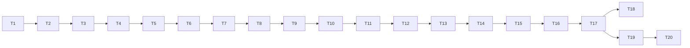

# Build Tasks: Minimal Terminal Coding Agent

Derived from `architecture.md`. Each task is **discrete, independently executable, and verifiable**. Hand them to an agent one at a time in dependency order. Section references (e.g. §8) point to `architecture.md`.

## How to use this document

- Each task has: **Goal**, **Depends on**, **Files**, **Do**, and **Acceptance criteria** (objective checks).
- Do not start a task until its dependencies are merged.
- Keep changes scoped to the listed files; if a task needs more, note it rather than silently expanding scope.
- After each task, the project must remain runnable (`python -m agent.main`) unless the task explicitly builds a not-yet-wired module.

## Dependency graph (execution order)

Critical path is linear by design (teaching tool); T18/T19/T20 can be parallelized after T17.

---

## Phase 0 — Foundation

### T1 — Project scaffolding
- **Goal:** Create the package skeleton and a runnable entry point.
- **Depends on:** —
- **Files:** `requirements.txt`, `.env.example`, `README.md` (skeleton), `agent/__init__.py`, `agent/main.py`, `agent/tools/__init__.py`, `agent/ui/__init__.py`.
- **Do:**
  - Create the directory layout from §4.
  - `requirements.txt` with `anthropic>=0.40`, `rich>=13.7`, `python-dotenv>=1.0`.
  - `.env.example` with `ANTHROPIC_API_KEY=` and `ANTHROPIC_MODEL=`.
  - `agent/main.py` prints a styled banner via `rich` and exits (REPL added later).
- **Acceptance criteria:**
  - `pip install -r requirements.txt` succeeds.
  - `python -m agent.main` prints the banner and exits 0.

### T2 — Configuration (`config.py`)
- **Goal:** Centralized config + env loading with fail-fast validation.
- **Depends on:** T1
- **Files:** `agent/config.py`, update `agent/main.py`.
- **Do:**
  - Implement `AgentConfig` dataclass exactly per §5 (model, max_tokens, thinking_budget=4096, thinking_display="summarized", max_subagent_depth=1, bash_timeout_s=120, max_tool_output_chars=20000).
  - `load_config()` that calls `dotenv.load_dotenv()`, reads `ANTHROPIC_API_KEY` (required) and `ANTHROPIC_MODEL` (optional override).
  - Validate `1024 <= thinking_budget < max_tokens`.
- **Acceptance criteria:**
  - Missing `ANTHROPIC_API_KEY` ⇒ clear error message, non-zero exit.
  - With a key set, `load_config()` returns a populated `AgentConfig`.
  - Invalid budget/max_tokens raises a clear error.

---

## Phase 1 — Event System & UI

### T3 — Event bus (`events.py`)
- **Goal:** The one-way observability backbone.
- **Depends on:** T2
- **Files:** `agent/events.py`.
- **Do:**
  - Implement `EventType` (all members in §5.5): lifecycle members `PRE_TOOL_USE`, `POST_TOOL_USE`, `SUBAGENT_START`, `SUBAGENT_STOP`, `STOP` (with Claude Code string values `"PreToolUse"`, `"PostToolUse"`, `"SubagentStart"`, `"SubagentStop"`, `"Stop"`), plus content members `USER_INPUT`, `THINKING`, `AGENT_TEXT`, `ERROR`, `NOTICE`. Then `Event` dataclass (`type`, `depth=0`, `payload`), `Listener` protocol, and `EventBus` (`subscribe`, `emit`).
  - `emit` does synchronous in-order fan-out and **swallows listener exceptions** (D14).
- **Acceptance criteria:**
  - Unit test: a recording listener receives emitted events in order.
  - Unit test: a listener that raises does not break `emit` for other listeners.
  - Enum string values match Claude Code names exactly (`"PreToolUse"`, `"PostToolUse"`, `"SubagentStart"`, `"SubagentStop"`, `"Stop"`).

### T4 — Console renderer listener (`ui/`)
- **Goal:** Render events to a polished terminal UI.
- **Depends on:** T3
- **Files:** `agent/ui/console.py`, `agent/ui/renderer.py`.
- **Do:**
  - `console.py`: a shared `rich.Console`.
  - `renderer.py`: `ConsoleRenderer` implementing `Listener` with one handler per relevant `EventType` (§11 table) and the visual conventions (thinking dim/italic; tool call cyan/magenta by depth; result green/red; markdown for agent text; depth indentation).
  - Use `rich.markdown.Markdown` and `rich.syntax.Syntax`.
- **Acceptance criteria:**
  - Feeding a hand-built sequence of events (USER_INPUT, THINKING, AGENT_TEXT, PRE_TOOL_USE, POST_TOOL_USE, SUBAGENT_START, SUBAGENT_STOP, STOP, ERROR) renders without error.
  - Sub-agent events (depth ≥ 1) are visibly indented and recolored.

### T5 — REPL wiring (`main.py`)
- **Goal:** Interactive loop that constructs the bus, subscribes the renderer, and reads user input.
- **Depends on:** T4
- **Files:** update `agent/main.py`.
- **Do:**
  - Create `EventBus`, subscribe `ConsoleRenderer`.
  - REPL: read a line, emit `USER_INPUT`, (temporary) echo via an `AGENT_TEXT`/`STOP` until the runner exists. `exit`/`quit` leaves; Ctrl-C cancels the line.
- **Acceptance criteria:**
  - Running the app shows a prompt, echoes typed input through the renderer, and exits cleanly on `exit`.

---

## Phase 2 — LLM Integration

### T6 — Anthropic client wrapper (`llm.py`)
- **Goal:** Encapsulate the Messages API with extended thinking + tools, enforcing all hard rules.
- **Depends on:** T5
- **Files:** `agent/llm.py`.
- **Do:**
  - `LLMClient.create(conversation, tool_schemas, system_prompt)` building the request per §6.1.
  - Enforce R1–R8: `tool_choice={"type":"auto"}`, `thinking={"type":"enabled","budget_tokens":cfg.thinking_budget,"display":"summarized"}`, **no** temperature/top_p/top_k, budget < max_tokens.
  - Return the raw response (content blocks + `stop_reason`).
- **Acceptance criteria:**
  - Unit test (mocked client): request kwargs include `tool_choice` auto, `thinking.display == "summarized"`, no sampling params, and `budget_tokens < max_tokens`.
  - Live smoke (manual, optional): a simple prompt returns a response containing a thinking block.

### T7 — Conversation model (`conversation.py`)
- **Goal:** In-memory, API-shaped message history that preserves thinking blocks verbatim.
- **Depends on:** T6
- **Files:** `agent/conversation.py`.
- **Do:** Implement `Conversation` per §7: `add_user_text`, `add_assistant_blocks` (unchanged, preserving thinking + signatures, R4/R5), `add_tool_results` (one user msg of `tool_result` blocks), `to_api`.
- **Acceptance criteria:**
  - Unit test: assistant blocks are stored byte-for-byte unchanged.
  - Unit test: `tool_result` block ids correspond 1:1 to preceding `tool_use` ids.

### T8 — Agent core loop, no tools (`runner.py` + `prompts.py`)
- **Goal:** A working chat loop with visible extended thinking.
- **Depends on:** T7
- **Files:** `agent/runner.py`, `agent/prompts.py`, update `agent/main.py`.
- **Do:**
  - `prompts.py`: main system prompt (§17).
  - `AgentRunner` holding conversation, bus, config, depth=0. Implement `run_turn` per §8 **minus** tool dispatch: emit `THINKING`/`AGENT_TEXT`, record assistant blocks, and emit `STOP` (only when `depth == 0`) when `stop_reason != "tool_use"`.
  - Wire `main.py` REPL to call `runner.run_turn`.
- **Acceptance criteria:**
  - End-to-end: a user prompt yields rendered thinking + answer; `STOP` fires once per turn.
  - No tools are advertised yet; the model cannot call tools.

---

## Phase 3 — Tools

### T9 — Tool framework (`tools/base.py` + registry)
- **Goal:** Pluggable tool interface and registry.
- **Depends on:** T8
- **Files:** `agent/tools/base.py`, update `agent/tools/__init__.py`.
- **Do:** Implement `Tool` ABC, `ToolResult` (with `to_block`), `ToolContext` (`cfg`, `bus`, `confirm`, `depth`, `workdir`) per §9.1, and `build_registry(ctx)` returning `{name: Tool}` + schemas. (Confirmer may be a stub/placeholder until T12.)
- **Acceptance criteria:**
  - Unit test: a dummy tool registers, exposes a valid schema, and `run` returns a `ToolResult` convertible to a `tool_result` block.

### T10 — `read_file` tool
- **Goal:** First concrete (non-destructive) tool.
- **Depends on:** T9
- **Files:** `agent/tools/read_file.py`, register it.
- **Do:** Implement per §9.2: input `{path, offset?, limit?}`, UTF-8 read, optional line slice, line-numbered output; errors for missing path / directory. `destructive=False`.
- **Acceptance criteria:**
  - Unit tests (use `tmp_path`): full read, sliced read, missing-file error, directory error.

### T11 — Tool dispatch in the loop (`runner.py`)
- **Goal:** Execute tools within `run_turn` with lifecycle events.
- **Depends on:** T10
- **Files:** update `agent/runner.py`.
- **Do:**
  - Implement `dispatch_tool` per §8: emit `PRE_TOOL_USE`, look up tool (unknown ⇒ error `POST_TOOL_USE`), run, truncate to `max_tool_output_chars`, emit `POST_TOOL_USE`.
  - Add the `for _ in range(MAX_ITERATIONS)` loop with `NOTICE` on cap.
  - Advertise registered tool schemas to the LLM.
- **Acceptance criteria:**
  - End-to-end with `read_file`: model can read a file; `PRE_TOOL_USE`→`POST_TOOL_USE` events fire around it.
  - Event-bus test (RecordingListener): order is `THINKING` → `PRE_TOOL_USE` → `POST_TOOL_USE` → `STOP`.
  - Unknown tool name yields an error `POST_TOOL_USE` and the loop continues.

### T12 — Confirmer (`ui/confirm.py`)
- **Goal:** Interactive approval gate for destructive actions.
- **Depends on:** T11
- **Files:** `agent/ui/confirm.py`, wire into `ToolContext` in `main.py`.
- **Do:** Implement `Confirmer.ask(action, preview) -> bool` per §12: render preview, prompt `[y]es/[n]o/[a]llow-all`, session-level allow-all flag. Direct synchronous call (not on the bus).
- **Acceptance criteria:**
  - Unit test (mock input): `y`→True, `n`→False, `a`→True and sets allow-all so the next call auto-returns True.

### T13 — `write_file` tool
- **Goal:** Destructive file creation/overwrite with confirmation.
- **Depends on:** T12
- **Files:** `agent/tools/write_file.py`, register it.
- **Do:** Per §9.2: input `{path, content}`, create parent dirs, overwrite; `destructive=True`; preview = path + syntax-highlighted content; `dispatch_tool` emits `PRE_TOOL_USE` before `Confirmer.ask`.
- **Acceptance criteria:**
  - Unit test: writes file (with dir creation); decline path does not write and returns a non-error declined result.
  - Confirmation preview shows before write.

### T14 — `edit_file` tool
- **Goal:** Exact-match edit with diff preview.
- **Depends on:** T13
- **Files:** `agent/tools/edit_file.py`, register it.
- **Do:** Per §9.2: input `{path, old_string, new_string, replace_all?}`; error if not found or non-unique without `replace_all`; `destructive=True`; preview = unified diff.
- **Acceptance criteria:**
  - Unit tests: single replace; `replace_all`; not-found error; ambiguous (multi-match) error without `replace_all`.

### T15 — `bash` tool
- **Goal:** Run shell commands with timeout, truncation, and confirmation.
- **Depends on:** T14
- **Files:** `agent/tools/bash.py`, register it.
- **Do:** Per §9.2: `subprocess.run(..., shell=True, cwd=workdir, capture_output=True, text=True, timeout=cfg.bash_timeout_s)`; combine stdout+stderr + exit code; truncate; `destructive=True`; preview = the command.
- **Acceptance criteria:**
  - Unit tests: successful command output + exit code; non-zero exit captured; timeout ⇒ error result; output truncated at limit.

---

## Phase 4 — Sub-agents

### T16 — `spawn_subagent` tool
- **Goal:** Delegate scoped tasks to a nested agent.
- **Depends on:** T15
- **Files:** `agent/tools/subagent.py`, register it; add sub-agent prompt to `agent/prompts.py`.
- **Do:** Per §10:
  - Input `{task, context?}`.
  - Build a **new `AgentRunner`** at `depth+1` with the **same bus and Confirmer**, a fresh `Conversation` seeded with `SUBAGENT_SYSTEM` + task, and a **restricted registry** (read/write/edit/bash, **no** `spawn_subagent`; enforce `max_subagent_depth`).
  - Emit `SUBAGENT_START` before running; run the child to completion; emit `SUBAGENT_STOP` with the summary; return the child's final text as the tool result.
- **Acceptance criteria:**
  - Event-bus test: spawning emits `SUBAGENT_START` … child `PRE/POST_TOOL_USE` at depth 1 … `SUBAGENT_STOP`; the child does **not** emit `STOP`.
  - Sub-agent registry excludes `spawn_subagent`; depth never exceeds `max_subagent_depth`.
  - Destructive actions inside the sub-agent still hit the shared `Confirmer`.

---

## Phase 5 — Hardening, Extensibility, Tests, Docs

### T17 — Error handling & resilience
- **Goal:** Robust session that never crashes on recoverable errors.
- **Depends on:** T16
- **Files:** update `agent/runner.py`, `agent/main.py`, tools as needed.
- **Do:** Implement the §13 matrix: tool errors → error `POST_TOOL_USE`/`tool_result`; `anthropic.APIError` → emit `ERROR`, abort turn, keep session; `KeyboardInterrupt` → cancel turn, return to prompt; iteration cap → `NOTICE`; ensure `EventBus.emit` already isolates listener errors.
- **Acceptance criteria:**
  - Simulated API error emits `ERROR` and the REPL survives.
  - Ctrl-C during a turn returns to the prompt without exiting.
  - A tool raising an exception yields an error result; loop continues.

### T18 — Transcript listener (extensibility demo) [optional]
- **Goal:** Prove the bus supports multiple sinks.
- **Depends on:** T17
- **Files:** `agent/ui/transcript.py` (or `agent/transcript.py`), wire optional subscription in `main.py`.
- **Do:** `TranscriptListener` that appends every event as a line of JSON to a `.jsonl` file. Enable via a config flag or env var.
- **Acceptance criteria:**
  - With it enabled, a session produces a `.jsonl` with one record per event; disabling it changes nothing else.

### T19 — Test suite
- **Goal:** Automated coverage of core logic.
- **Depends on:** T17 (can run parallel to T18)
- **Files:** `tests/` (`test_tools.py`, `test_events.py`, `test_conversation.py`, `test_llm.py`), add `pytest` to dev deps.
- **Do:** Implement §16: tool unit tests (`tmp_path`), event-bus ordering/depth tests with a `RecordingListener` (incl. sub-agent `SubagentStart…SubagentStop`, no child `STOP`), conversation block-preservation/id-matching, LLM request-kwarg assertions (R1–R7) via a mocked client.
- **Acceptance criteria:**
  - `pytest` passes locally with no network calls (Anthropic client mocked).

### T20 — README & usage docs
- **Goal:** Make the project runnable and understandable by a newcomer.
- **Depends on:** T17
- **Files:** `README.md`.
- **Do:** Setup (venv, install, `.env`), how to run, a sample session, the safety/sandbox warning (§14), and a short architecture overview linking `architecture.md`.
- **Acceptance criteria:**
  - A new user can follow the README from clone to a working session.
  - The security/sandbox caveat is clearly stated.

---

## Summary table

| ID | Task | Depends on | Primary files |
|---|---|---|---|
| T1 | Project scaffolding | — | `requirements.txt`, `agent/` skeleton, `main.py` |
| T2 | Configuration | T1 | `config.py` |
| T3 | Event bus | T2 | `events.py` |
| T4 | Console renderer listener | T3 | `ui/console.py`, `ui/renderer.py` |
| T5 | REPL wiring | T4 | `main.py` |
| T6 | Anthropic client wrapper | T5 | `llm.py` |
| T7 | Conversation model | T6 | `conversation.py` |
| T8 | Agent core loop (no tools) | T7 | `runner.py`, `prompts.py` |
| T9 | Tool framework | T8 | `tools/base.py` |
| T10 | `read_file` tool | T9 | `tools/read_file.py` |
| T11 | Tool dispatch in loop | T10 | `runner.py` |
| T12 | Confirmer | T11 | `ui/confirm.py` |
| T13 | `write_file` tool | T12 | `tools/write_file.py` |
| T14 | `edit_file` tool | T13 | `tools/edit_file.py` |
| T15 | `bash` tool | T14 | `tools/bash.py` |
| T16 | `spawn_subagent` tool | T15 | `tools/subagent.py`, `prompts.py` |
| T17 | Error handling | T16 | `runner.py`, `main.py` |
| T18 | Transcript listener (optional) | T17 | `ui/transcript.py` |
| T19 | Test suite | T17 | `tests/` |
| T20 | README & docs | T17 | `README.md` |
